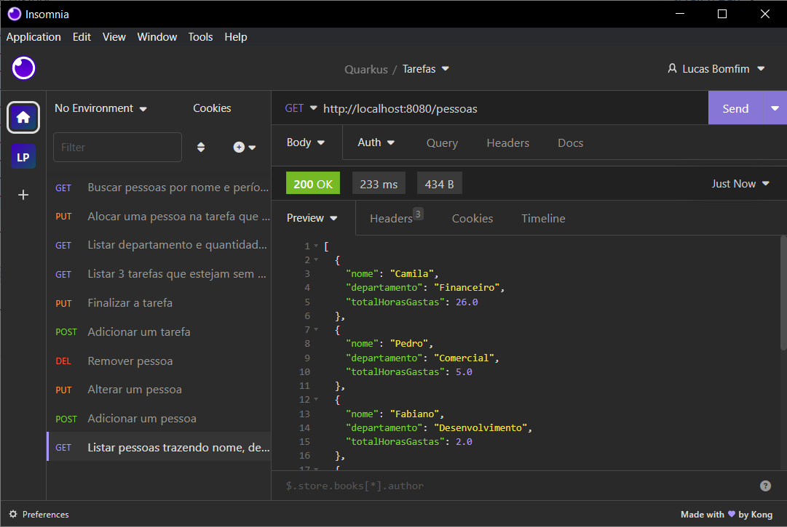

# API de Gerenciamento de Tarefas

Bem-vindo à API de Gerenciamento de Tarefas! Esta API foi desenvolvida como parte de um desafio para uma vaga de desenvolvedor e tem como objetivo fornecer endpoints para criar, atualizar, visualizar e excluir tarefas, departamentos e pessoas.

## Funcionalidades Principais

- Cadastro, edição, remoção e listagem de tarefas.
- Associação de tarefas a pessoas e departamentos.
- Filtro e ordenação de tarefas por diversos critérios.

## Tecnologias Utilizadas

- Linguagem de programação: Java
- Framework: Spring Boot
- Banco de Dados: PostgreSQL
- Gerenciamento de Dependências: Maven
- Containerização: Docker e Docker Compose
- Testes: JUnit, Mockito

## Como Executar

Para executar a API localmente, siga os passos abaixo:

1. Certifique-se de ter o Java JDK 17 e o Maven instalados em sua máquina.
2. Clone este repositório para o seu ambiente local.
3. Configure as variáveis de ambiente no arquivo `application.properties` com as informações do seu banco de dados PostgreSQL.
4. Execute o comando `mvn spring-boot:run` no terminal dentro da pasta do projeto.
5. Use a `http://localhost:8080/` para testar a API.

Também deixei para fins mais práticos, um arquivo docker-compose com as instruções necessárias para rodar tanto a aplicação Spring Boot quanto o banco de dados.
Para executar usando docker basta:

1. Certifique-se de ter o Docker instalado e rodando na sua máquina
2. Execute na pasta raíz do projeto o comando `docker-compose up`.

E pronto, aplicação rodando em `http://localhost:8080/` e postgreSQL em `http://localhost:5432/`

## Endpoints Principais

- `POST /pessoas`: Adiciona uma nova pessoa ao sistema.
- `PUT /pessoas/{id}`: Atualiza os dados de uma pessoa existente com base no ID fornecido.
- `DELETE /pessoas/{id}`: Remove uma pessoa do sistema com base no ID fornecido.
- `POST /tarefas`: Cria uma nova tarefa no sistema.
- `PUT /tarefas/alocar/{id}`: Aloca uma pessoa em uma tarefa específica, desde que a pessoa pertença ao mesmo departamento da tarefa.
- `PUT /tarefas/finalizar/{id}`: Marca uma tarefa como finalizada com base no ID fornecido.
- `GET /pessoas`: Retorna uma lista de pessoas cadastradas no sistema, incluindo o nome, departamento e o total de horas gastas nas tarefas..
- `GET /pessoas/gastos`: Busca pessoas pelo nome e período especificado, retornando a média de horas gastas por tarefa.
- `GET /tarefas/pendentes`: Retorna uma lista das 3 tarefas sem pessoa alocada com os prazos mais antigos.
- `GET /departamentos`: Retorna uma lista de departamentos cadastrados no sistema, incluindo a quantidade de pessoas e tarefas associadas a cada departamento..

> **Nota Importante:** Caso o banco de dados esteja vazio, muitas dessa endpoints não irão funcionar corretamente, para isso, adicionei um arquivo chamado `data.sql`, nele é feito um `INSERT` usando os mesmos dados apresentados na parte do desafio de SQL, basta executar esses comandos dentro do banco de dados e tudo deve funcionar corretamente.

Para facilicitação dos testes da api, deixei no arquivo "Tarefas-Project_2024-03-15.json" uma serie de requests do insomnia já prontos como ilustrado na imagem abaixo, deixando cada requisito como o nome do request:
